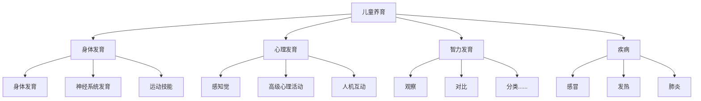
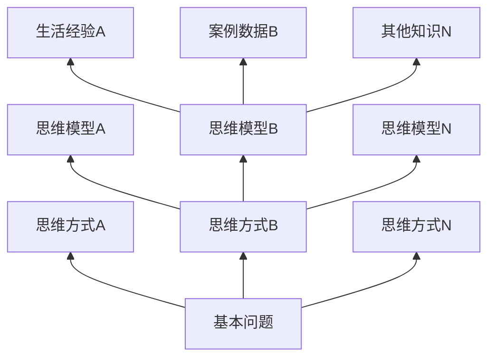
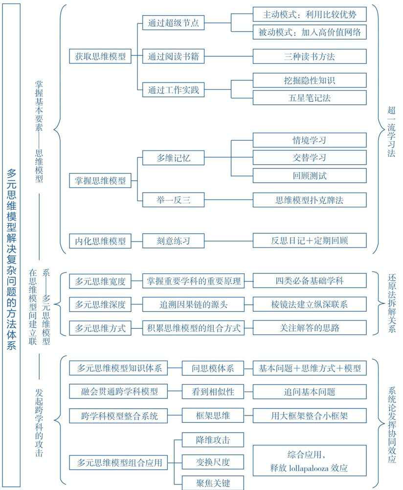

# 好好思考

>  原作者：成甲，北京联合出版公司，2019.10
>
> 编者：Kelvin Zhao
>
> 瘦书计划：https://github.com/kelvinzhao/Thinbooks

[toc]

## 本书主题

什么是多元思维模型，系统阐述如何建立多元思维模型，并内化为个人的深度洞察力，提高决策质量。

## 自序

1. 当我们工作一段时间后，对工作环境和任务都比较熟悉后，就会发现自己能学到的东西少了，成长的速度慢了很多。

>  查理·芒格认为，学习并不是追求更多的知识，而是寻找更好的决策依据，这个更好的决策依据，就是那些经过广泛验证的原理和规律，称之为**思维模型**。

2. 思维模型颠覆了学习和成长的基本单位，它不再以知识为单位，而是以各个学科的原理、规律作为知识管理、思考问题的基础。

3. 我们真正追求的目标是把思维模型作为分析解决问题的工具，用抽象的多元思维模型[^1]洞察问题的本质，找到解决问题关键的杠杆点。


| 全书结构                            | 章节                                                     |
| ----------------------------------- | -------------------------------------------------------- |
| 1. 了解：什么是思维模型             | 第一章  引言<br />第二章  多元思维模型：终身学习者的利器 |
| 2. 学习：如何高效学习和掌握思维模型 | 第三章  学习掌握思维模型的实战方法                       |
| 3. 架构：如何融合跨学科思维模型     | 第四章  如何建立多元思维模型知识体系                     |
| 4. 运用：如何运用思维模型解决问题   | 第五章 综合运用多元思维模型解决复杂问题                  |

## 一、引言

1. 我们做决策的依据主要是个人的过往经验，但随着社会快速发展，「经验」越来越有局限性。**你的父母怎么会有经验知道你如何在抖音时代建立自己的影响力？**我们需要有新的决策依据。

2. 用**不同学科的原理**作决策比个人经验更有效。使用被人类严谨、反复验证的跨学科原理和规律做决策依据，作出正确决策的概率会大幅提升。

3. 大多数人在学习和解决问题过程中，总是习惯在自己的专业领域找答案。但跨学科学习的关键根本不是学习更多的知识，而是找到不同领域间面临的共同问题。

   案例：游戏开发公司为持续生产创意而学习好莱坞皮克斯公司的方法论。

4. 一旦脱下问题的外衣，去看内在的结构，不同领域解决方式的策略，都是可以给我们启发和借鉴的。我们可以去找发展水平更好领域的解决方法，搬到发展水平较低的领域。是我们解决创新问题的一种重要策略。


## 二、多元思维模型：终身学习者的利器

### 2.1 什么是多元思维模型

1. 面对不断的激烈的竞争，巴菲特都要一直学习，让自己成为一个学习机器。未来的竞争，要求更高的洞察力，如何提高洞察力呢？

2. 提高洞察力的关键不在于学习更多的知识，而是找到更底层的规律。不去追寻问题背后的规律和原理，就无法大幅突破自我认知边界。

3. 如何实现？掌握多元思维模型。

4. **什么是多元思维模型**，暂且定义为——每个人做决策思考问题时的「思维模板」。

   如何掌握多元思维模型，查理·芒格说，

   > 你必须知道重要学科的重要原理，并经常使用它们——要全部都用上，而不是只用几种。大多数人只使用学过的一门学科的思维模型，比如经济学，试图用一种方法来解决所有问题。

   查理·芒格的建议：

   1）我们应当构建基于思维模型的知识体系；

   2）这些思维模型应当是来自多个重要学科的重要原理；

   3）积极、全面的应用思维模型。

5. 在具体问题答案的基础上，提炼更普遍的方法，本质上是从现象中抽象规律和原理——不断追问问题和答案的背后是否隐藏着更具普遍性的解决问题的思路和原则。

6. 从不同行业、不同领域的思想实践中，掌握不同学科的思维模型，提高抽取本质的能力即洞察力，这是未来最大的竞争优势。

### 2.2 思维模型解决问题的四个层次

1. 事实上，解决任何一个问题的有效策略，都可以从经验技巧、方法论、学科原理和哲学视角四个层次逐层深入和理解。这种分层分解法称之为「棱镜法」。

   案例：「动批」服装市场砍价策略——从脚脖子上砍。

   四个层次上的分解：

   1) 经验技巧 —— 从脚脖子上砍

   2) 方法论 —— 谈判方法论

   3) 学科原理 —— 心理学锚定效应

   4) 哲学视角 —— 人性弱点

2. 最有效的策略往往不是来自答案，而是来自思考答案的方式。

   案例：暴雨洪水恺撒三万士兵被困，暗挖河沟反围九万敌军[^2]。

   1) 问题：与敌军对垒时，士兵被洪水包围，陷入绝境。

   2) 一般人思考：如何摆脱困境

   3) 恺撒思考：一定是困境吗？面对的劣势能否转为优势？

   4) 恺撒行为：暗中在上游挖河沟将洪水导入敌军身后，反围困九万敌军。

   5) 思维模式：1. 质疑我们提出的问题本身；2. 从问题的源头思考解决方案。

   参考：「学历史的大用」 [^3]

## 三、学习掌握思维模型的实战方法

### 3.1 通过读书寻找思维模型

1.  查字典法——快速发现有效的经验策略和方法论

   如果我们要在书中找到思维模型，也不需要把一本书看完，而是可以把书当作「字典」 ，遇到问题去查找相关的模型即可。这样速度虽快，但掌握不牢固，可以搭配「不读书法」，即，看书看到兴趣点时合上书，进行思考提问：

   - 为什么刚才这个点让自己有启发？它在解决什么问题？
   - 生活中还有类似的问题吗？自己能把这个启发点用在生活中吗？
   - 这个启发点有没有其他类似的知识？

2. 关键词法——寻找更系统的思维模型

   就是把阅读的单位，从在文章中找模型单点突破上升到从全书中找分析逻辑的系统思维。具体分为三部：

   1）分析确定作者在书中要解决的核心问题是什么。通常在封皮、推荐序、自序、全书开头或结尾中可以找到。
   

2）寻找书中与核心问题相关的关键词有哪些。

3）这些关键词之间的关系是什么，他们是以什么逻辑解决问题的，有哪些有效的策略。

3. 知人论世法——看到思维方式和策略的局限性

   作者在书中提出的思想、观点与他所处的时代背景、个人经历、思维方式密切相关。读书的时候要全面结合着去理解。不要片面的只看结论，还要搞清楚（或警惕）所适用的环境

   「知人论世」 是指，我们为了弄明白一件事情，既要了解这个人，也要研究任务所处的时代。所以我们要弄明白一些重要问题的答案，尤其是我们不太熟悉的问题时，必须了解提出答案的人所处的时代背景、个人经历和思维方式。即，**要理解一个思维模型的产生条件及其适用边界，没有正确的思维模型，只有适合某种情况的思维模型**。

4. 思想地图法—— 「搭便车」方式形成全局视角

   1）《通识：学问的分类》[^4]记录了各学科发展过程中，不同时期代表人物及其思想概要的总结图。

   2）阅读各个领域的思想发展史，例如找思想史类图书，可以优先看获得「萨顿奖」的作者著作[^5]。

   3）研读相关领域「研究综述」，看学术文献，在百度学术、中国知网等网站上搜索相关主题的研究综述，可以快速对一个领域有全新的认知。

### 3.2 在工作中学习思维模型

1. 身边有好老师，为何学不到？

   因为别人工作中总结出解决问题的有效策略，往往是以「隐形知识」的方式呈现的。

   **工作中快速进步的关键：找到别人的优势策略，把隐形知识转化为显性思维模型。**

2. 我们要多花时间挖掘优秀同事身上的「隐形知识」：
   1. 他们是如何安排工作的？
   2. 他们是如何思考问题的？
   3. 他们为什么做出这样的决策？
   4. 这些行动背后的思维模型又是什么？

3. 通过记笔记的方式把工作中的隐形知识转化为思维模型（显性化）。

   案例1：「在奇虎公司里能和周鸿祎进行思维对话的只有两个人，其中一个就是傅盛。」

   猎豹创始人傅盛曾在一篇文章中提到，在公司做会议纪要对他的快速成长帮助很大。傅盛在整理周鸿祎会议纪要时思考的是：周总为什么要说这句话？他为什么又从这个话题跳到新话题，背后的逻辑是什么？他真正想表达的是什么？

   傅盛总结他做会议纪要的经历：

   >  写会议纪要这件事重要的是，在这个过程中，整理、提炼、反思、深入思考别人思考和决策的方式，这本身就是一种学习。

   案例2：张五常在大学念书时，旁听了六个学期杰克·赫舒拉发的经济学课程。

   张五常的目的就是为了学会老师思考的方法。

   > 对于学习而言，最重要的永远不是具体的方法和结论，而是思考问题的过程，掌握别人的思维模型。能够通过做笔记学习整理优秀同事和前辈的隐形知识，把他们转化为自己的思维模型，正是特别搞笑的学习方法。

4. 「五星笔记法」，用笔记挖掘隐形知识

   做笔记的目的不是记录别人的知识，而是寻找更有效的解决问题的策略，完善你思考解决问题的知识体系。

   所谓「五星笔记法」，就是每次做笔记之前，先问五个问题，而做笔记的过程就是回答这五个问题的过程。

   **这五个问题也是通用的挖掘隐形知识的方法。**

   1. 核心内容是什么
      预判对方要讲的核心内容是什么，为什么这个内容值得讨论。
   2. 讲解逻辑是什么
      尝试画出对方讲述的关键词之间的逻辑，推测对方的思考过程。
   3. 有哪些疑问和启发
   4. 提炼出思维模型是什么
      顺着启发点继续思考：这个方法解决什么问题？这个策略为什么有效？策略的来源和依据是什么？
   5. 这些启发哪些可以立刻变成「下一步」的行动？如何把他们运用到自己的生活？

   案例：一个笑话：KTV中，「我是隔壁的，真心话大冒险输了，惩罚来这里唱歌」，从而免费唱歌喝酒。[^6]

   用「五星笔记法」深挖：

   （1）这个笑话在讲什么问题？
   		*如何在没钱的情况下，免费在KTV唱歌。*

   （2）这个人解决问题的逻辑是什么？
   		通过利用大家都熟悉的KTV游戏「真心话大冒险」，在多个包厢中免费唱歌。

   （3）这个解决方案给我什么启发或疑问？
   		表面上是利用别人的资源实现自己的目的。实际上，他创造了一种价值交换机制。因为，在KTV消费场景下，人们本质上是购买了一段快乐的时光，而陌生人玩大冒险游戏来唱歌，其实是为唱KTV的人提供了新鲜的体验。本质上这个人是用时间和服务，为别人创造了欢乐时光。

   ​		此案例的局限性：例如，只能唱一两首，多了人家肯定不同意；频繁更换包厢带来更大的识破风险——有可能有人会提出要随此人回去「相互参观」。

   （4）这个人的做法，我可以提炼出什么有效策略（思维模型）？

   ​		提供一个解决在直接资源不足时，如何实现自己目的的策略——借助产品创新或组织创新，利用生态环境中的已有资源发展自己。

   （5）这个启发，我如何把它用在生活里？

   「五星笔记法」记录笔记的内容只花费20%的时间，其他时间都花在整理笔记和思考和查阅相关资料上。

### 3.3 掌握思维模型的实战方法：「超一流」学习法

所谓「超一流」，是在生活中提炼和运用思维模型的三个核心环节。

「超」，即超级人脉：是指遇到问题时要先从超级人脉找答案，提炼思维模型。

「一」，即举一反三：是指对思维模型举一反三，多维实践。

「流」，是指要把掌握的思维模型训练成「直觉」。

掌握思维模型的核心流程：

​	  **遇到问题  ➡️  超级人脉寻找答案  ➡️  超越答案提炼模型  ➡️  举一反三理解模型  ➡️  可以练习内化直觉**

1. 「超级人脉」

   - 主动寻找超级人脉，真正高效解决问题的方式，不是读书和观察，而是直接求教于有能力的高手。

   案例：1949年，巴菲特看了《聪明的投资者》这本书，想拜作者「华尔街教父」——本杰明·格雷厄姆为师，通过两年不懈努力，终于获得免费给他干活的机会，从而能够深入地和高手朝夕相处。

   找超级人脉更大的意义在于，借此可以加入一个更高质量的「人脉网络」，从而获得更高质量的信息和资源。

   - 如何找到超级人脉

   案例：小马宋是如何找到「超级人脉」罗振宇并与之合作的。

   1. 小马宋对超级人脉感兴趣。小马宋想要了解罗辑思维会员收费背后的商业模式，于是想接近罗振宇。
   2. 寻找接触超级人脉的机会。小马宋借助商业活动或公司合作尝试接触罗振宇，均告失败，最终通过参与罗辑思维的营销活动见到超级人脉。
   3. 接触后寻找自己相对的比较优势。见面时，小马宋通过创意策划方面的经历和「三万订阅量的公众号，卖了一万本书」这件事吸引罗振宇的兴趣，促成后续的聊天和合作机会。
   4. 找到契合点，推动双方合作。

   - 与超级人脉合作不要觉得自己吃亏

   和超级人脉合作的时候，真正有价值的不是看得见的收入，而是通过超级节点让自己接入到一个全新的社会网络系统中。

   - 环境就是价值网

   「高价值网络」环境更容易产生创新机会，即看这个环境是否提供高频、高质量的信息、物质与能量的交换。越多元化的要素、越频繁的交流，就会带来越多的创新可能。例如一家名企，福利待遇都不错，但员工日复一日的工作在「确定性」中，工作中少有变化，那么，在我看来，这公司也是一个「低价值网络」。如果在一家小公司，哪怕只是个销售，但每天能接触各行各业的精英，看到他们为人处世的方法，只要你留心学习和建立信任关系，那么个这个小公司也是一个「高价值网络」。

   **不要简单的从「名气」、「岗位」来理解一件事情的意义和价值，而要看这件事情会不会带给我们频繁高质量地接触各种资源的机会，这才是创造新价值的关键。**

   必须承认，我们并不是一致都能很幸运地找到「超级人脉」这样的老师，如果不能在现实中和高手建立联系，我们还可以退而求其次，阅读大师和高手的书籍或文章。

   大师级人脉分为四类：(1) 开创新领域的奠基型大师；(2) 建立新流派的转折型大师；(3) 统一各家观点的集大成者大师；(4) 持不同意见的反对者。

2. 「多维记忆」、「举一反三」[^7]

   脑科学研究发现，我们在记忆信息的时候，不仅记住了事情本身，还会把和事件相关的环境，乃至自己的情绪一并记录下来。因此，除了记忆思维模型本身，应用知识的环境背景、自己的心情、所处的时机，以及当时想起的其他知识和经历等，都可以成为我们理解和记忆相关知识的维度。这样，我们记忆思维模型的维度增加，效率也就大大提高了。

   - 多维记忆：

   1. 情景学习

      所谓「情景学习」，是指在学习知识的时候，要尽可能在不同场景下学习。更有效的方法是提前构建需要唤醒记忆知识的场景（可参考「记忆宫殿」）。简单一句话：**未来怎么用知识，现在就怎么记知识。**

      应用情景学习法不仅让我们每次在不同的情景中，关注问题的不同侧面，增加对已有知识的新认识，同时变换场景后，还会顺便让我们学习新的相关知识，进一步在不同的只是之间建立广泛的联系，这对构建我们的知识关系网大有裨益。

   2. 交替学习

      所谓「交替学习」，是指我们要交替变换学习的内容。实践证明，长时间单纯地学习一门学科，效果并不好，因为相同性质的材料刺激脑神经过于单调，时间一长，大脑相应区域很容易由于负担过重而疲劳。所以，我们应该有意识地把需要不同思考技术和策略的问题来回转换，交替学习。

   3. 回顾测试

      所谓「回顾测试」，一方面我们要定期对学过的知识进行回顾。另一方面，要避免机械、单调地回顾，需要主动应用「测试效应」来提高内化的效率。

      所谓「测试效应」，是指当我们带着测试目的进行回顾时，要比单纯地再看一遍效果好很多。对我们而言，回顾时设置的测试，不仅能够增强大脑的记忆力，而且每次测试都是将已有知识在不同场景中进行应用，这对我们灵活理解知识也有很大的帮助。

   - 举一反三：

   为了掌握一个思维模型，我们要把它至少变换三个不同的场景来应用。如何将思维模型与具体的应用场景相关联呢？——「思维模型扑克牌法」。

   即，制作思维模型卡片，写下思维模型的用途。当遇到困难和问题时，逐张拿出卡片，如果卡片上的思维模型能够用到现在的问题中，就在该卡片上记录下此问题应用案例和适用范围。我也计划开发一套适用于日常生活的思维模型扑克。[^8]

3. 「流」：「实践练习」到「行云流水」

   我们通常认为，要找到复杂问题的答案，一定要经过大量的研究分析才可以。但真相往往是，专家看一眼就能找到问题的症结，而新手分析半天也找不到要害。

   在面对极为复杂的情况时，专家的大脑潜意识能够在瞬间把各种过往知识、经验快速调用形成直接的判断，而这就是知识内化的结果。

   - 把复杂问题自动化处理

     新手司机受忙脚乱，老司机还能边开车边聊天。

     大脑分为「工作记忆区」和「长期记忆区」，你觉得自己在想问题、动脑筋的时候，都是工作记忆区在处理，它的「CPU」是个四核处理器，可以理解同时最多只能处理四组信息，所以新手学开车时要同时应对油门、刹车、方向盘、离合器，就无法再和别人聊天。

     而老司机的大脑已经将「开车」这件事整合成了一组信息，这样他就能处理更多的新任务了。对于老司机而言，驾驶汽车的一系列动作已经自动化了，有时大脑只用潜意识在开车。专家分析问题效率高，是因为他们熟练内化了很多知识，把复杂问题自动化处理，最终形成了「模式识别」能力。

   - 直觉反应的核心：模式识别

     新手在思考分析问题的时候，往往觉得每个问题都是新问题。而专家看问题时，由于经验丰富，往往能一眼看到问题背后的「模式」(Pattern) ，能够观察到问题的整体特征，从而快速聚焦到异常部分，找到问题症结。

     案例：火场中，消防队队长觉得不对劲，让队员撤出，之后房屋倒塌。[^9]

     正如《教父》经典台词所言：

     > 花半秒钟就能看透事物本质的人，和花一辈子都看不清事物本质的人，注定是截然不同的命运。

     专家看似半秒钟轻而易举地做出判断，是长期努力、大量训练，把知识经验内化，最终形成模式识别的能力。

   - 内化的核心方法

     - 方法1：用「熟悉」理解「陌生」

       即，用熟悉的事物理解陌生的新知识。大脑习惯并擅长用熟悉的问题类比陌生问题，通过类比我们可以对一个陌生问题快速建立的认识。往往类比的相似之处未必反应问题的全貌，但这并不影响我们用不同的类比，从不同的角度理解问题。因此，如果我们想要提升自己学习新知识的速度，就应该专门花时间思考：这个新领域的知识可以用到哪些更熟悉的知识类比理解？

       很多时候，我们只顾着学习新知识，却很少花时间从新知识中抽离出来，寻找已有的知识中，有哪些事物和新知识有相似性。这种寻找事物之间相似「模式」的能力，是认知内化的高级水平。

     - 方法2：用「重复」提升「速度」

       瞬间反应的能力，本质上是通过大量重复练习，把反应速度一步步提升到直觉程度实现的。知识的内化也是类似的道理，我们需要不断地重复练习，把最重要的思维「招式」内化到「无招胜有招」的境界。

       思维肇事的练习场所——反思日记。周末，我经常会根据最近遇到的问题和环境的变化，推演接下来可以用哪些思维模型应对，接下来可能遇到的问题，并以此作计划、实践。等践行一段时间后，再复盘总结，看我当初的设想和实际执行之间有哪些差别。这样坚持下去，就会对各种思维模型的应用有围观体验，做决策时就会依据原理灵活应用。

       反思日记的习惯能形成系统的档案，这对我们回顾、复盘、改进提升认知能力有着极为重要的作用。如果我们定期、有规律、有格式地记录自己的思维方式和方法，那么我们就可以看到自己思想方法的局限性，理解自己思维演变的过程，从而更好地找到自己思维的盲点，尽力避免陷入「无知的自信」中。

   - 「内化」经历的五个阶段，如下表。


| 各个阶段               | 表现                                                         | 知识应用特点                           |
| :--------------------- | ------------------------------------------------------------ | -------------------------------------- |
| 第一阶段：不知不觉     | 我们学习了一个知识，但在生活中遇到问题时却想不起来，问题换了个「马甲」，我们就认不出来了。 | 知识是孤立的，和应用场景脱节           |
| 第二阶段：事后诸葛亮   | 做完某件事后，突然想起某个策略刚才可以应用，事后诸葛亮。多几次这样的经历，我们就会对应用这个知识更敏感了。 | 大脑对类似的应用场景和知识之间联系较弱 |
| 第三阶段：中途调头     | 做到一半才想起来可以应用某个知识。                           | 看到类似场景，能够联想到相关知识       |
| 第四阶段：刻意为之     | 遇到相关问题时，第一时间想起来应该应用某个知识               | 大脑中知识和应用有较强联系             |
| 第五阶段：回到不知不觉 | 没意识到使用了某个知识来解决问题，已经内化了。               | 知识内化到直觉                         |

## 四、如何建立多元思维模型知识体系

前文所述掌握思维模型只是必备的基本功，想要用思维模型**创造性**地解决**复杂问题**，我们还需要培养更高阶的能力——建立跨学科的多元思维模型知识体系。

为什么我们一定要把思维模型组织成一个跨学科的知识体系呢？我们遇到问题时直接寻找有效策略不就可以了吗？

原因在于：

1. 每天都会遇到新问题，我们解决问题的速度赶不上问题产生的速度；
2. 你越擅长解决问题，越有新的问题找你解决。
3. 思维模型只是提高解决问题的效率，但它并不能减少问题的数量。

如何解决？从精简问题数量构建跨学科的知识体系入手。

### 4.1 为什么要具备跨学科解决问题的能力

1. 多样性红利

   美国密歇根大学复杂性研究中心「掌门人」斯科特·佩奇认为

   >  一个人是否聪明不是由智商决定的，而取决于思维模型的多样性。即「多样性红利」。

   罗振宇在一篇文章中说到

   > 只要是人类的思维模型，都必然体现的是一个残缺的世界，都必然忽略了真实世界的某个部分。当绝大多数人在用某种模型思考问题的时候，你能在关键问题上用不同的模型思考问题，你就容易获得认知优势。

   问题：我们在遇到问题的时候，如何找到跨学科的思维模型？

   答案：思考哪些领域解决这种问题的经验比较多，就从这个领域去找思维模型。

   案例：市场部同事每天都在接触新客户，沟通工作量大，要是能一下子就知道客户在想什么就好了。

   思考：

   1. 有哪些行业的人会和市场部同事工作性质近似，且也需要解决「快速了解他人想法」这个问题？
   2. 列举：负责招聘的HR、警察审讯犯罪嫌疑人等；
   3. 扩展策略：找人力资源介绍面试经验的书籍，看FBI破案时快速对人做判断的书籍，想到曾国藩专门写过识人的《冰鉴》。
   4. 总结相关行业：人力资源、军事、审讯等；相关学科：人格心理学、动机心理学、社会学等。

  2. 多元思维模型 ≠ 多个思维模型

     需要说明的是，虽然我们说要掌握多个不同的思维模型，但掌握多元思维模型，并不等于掌握多个思维模型，因为「多元」强调的是**掌握不同属性、学科的知识**。

     查理·芒格提醒我们：

     > 大多数人只使用学过的一个学科的思维模型，比如说经济学，试图用一种方法来解决所有问题。实际上，你必须知道重要学科的重要原理，并经常使用它们——要全部使用上，而不是只用几种。

     当思维模型之间产生所谓冲突时，往往是自己对思维模型的适用条件与其本质理解不够深刻，把不同层次、不同角度的思维模型对等起来，就会感到「错误的冲突」。例如「顶层设计」和「精益创业」都是企业战略思维模型，但二者相差较大，貌似「冲突」，但实际上这两种思维模型是适合于企业战略的不同问题和不同阶段的。

     「顶层设计」解决的是战略方向的问题，是对宏观环境的变化做出预判。

     「精益创业」解决的是具体策略的问题，是对微观生态的环境进行适应。

### 4.2 哪些领域的知识是人人都应该学习的

1. 建立全局性学习力

   跨领域学习多元思维模型，不是为了掌握更多的知识，而是要形成对问题的全局性理解，从而更本质地理解问题。所谓「全局理解」，是指我们能够从不同的角度和不同的层次全面地理解问题，从而接近问题的本质。一个人要构建全局理解的能力，就必须有足够多样的思维方式与足够丰富的知识层次。即，同时具备解决问题所需的足够的思维广度和思维深度。

2. 全面的思维方式

   更全面的思维方式，往往来自涉猎跟多的学科，即查理·芒格说的要掌握「重要学科的重要原理」。查理·芒格建议

   > 如果你想成为理性的思想者，必须培养出跨越常规学科疆域的头脑。而这需要大量阅读数学、生物学、物理学、社会学、心理学、哲学和文学等各学科及相关学科中著名科学家的重要论述，了解并熟悉书中介绍的核心概念，能够将不同学科的思维模式联系起来并融会贯通。

   我认为，在众多学科中有四类学科是我们都应该掌握的：

   1. 理解物质世界的基础学科，如物理学、数学、化学等。
   2. 理解群体系统规律的学科，如生物学、经济学、社会学等。
   3. 理解复杂系统规律的学科，如复杂性科学、人工智能、哲学等。
   4. 理解精神世界的人文学科，如心理学、美学、宗教、历史等。

   我们真正要知道的是支撑一门学科背后的思维方式是什么，因为我们关注的重点不是「更多的学科知识」，而是「更全面的思维方式」。

   如果从思维方式的角度思考不同学科的价值，我们就会发现，每门学科背后都有一套对应的思维方式，例如：

   - 数学发展出用「符号与逻辑推理」的思维方式；
   - 物理学发展出依靠「第一性原理」的思维方式；
   - 进化生物学发展出用「物竞天择」的系统方式；
   - 复杂性科学发展出用「系统思考」的思维方式；
   - 现代美学发展出不断「否定常规」的思维方式。

   我们要做的是找出学科背后重要的思维方式，并纳入自己的知识体系。

### 4.3 如何搭建高效的多元思维模型知识系统

怎样把跨学科的知识融入一个知识体系呢？

传统的知识体系的架构是「学科 —— 一级知识 —— 二级知识 —— 三级知识......」，以此类推，逐层细分。以「儿童养育」为例：



这种结构对于我们梳理一个领域的全局知识是有帮助的，可是，这种知识的组织方式有很大的问题。

1. 一个学科内的知识点都能这么简单清晰的分类吗？一旦深入下去，你会发现很多知识点并不容易归类，甚至有些知识点之间的逻辑关系是有矛盾冲突的。
2. 就算我们把知识点强行分类，这样的知识结构也只是把我们的存量知识进行了分类，我们并没有因此建立能够融会贯通的知识体系。
3. 这个体系的起点是一个学科，其他学科的知识无法放进来。

我想要构建一个新的知识体系，这个知识体系结构不受学科限制，能够把不同学科的知识组织在一个系统下。

那就是：**组织知识的关键不是知识，而是问题。**——「问思模」体系。

「问思模」体系和传统的知识体系有两大区别：

1. 新体系建立的起点既不是某个学科，也不是某个知识或思维模型，而是「基本问题」。因为所有的思维模型都是解决某个问题的有效策略，那么，统领知识的就应该是问题，而非答案。
2. 新体系没有直接把问题和知识联系起来，而是在两者之间引入了一个新要素：「思维方式」。这也是我们前面提到的在不同领域的思维模型之间建立联系的关键。

「问思模」知识体系的核心框架：基本问题 —— 思维方式 —— 具体思维模型。这个体系中最关键的环节是，**我们对同一个问题，用不同的思维方式思考，就能整合不同的有效策略，而我们的生活经验和其他知识都可以附着在这个强大的知识体系内。**用这样的方法就可以看到原来看起来并不相干的事物背后的深层关系，加深对现实问题的本质理解。「问思模」基本结构如下：



（此图中只着重表现了知识体系的金字塔模式，并没有体现不同基本问题、思维方式和思维模型之间的联系，那样此图会非常复杂。）

由上图可看出这个体系的一个特点：用基本问题把不同领域的思维方式、思维模型以及各种直接经验和间接经验、案例整合到了一起。其关键就是用「洞见事物相似性」来打破学科壁垒，让哥们学科的知识间建立密切联系。

### 4.4 建立跨学科知识体系的桥梁——看到「相似性」

1. 看到问题的相似性

   案例1：请问时装业、快餐业、半导体产业和香蕉业这四个行业有什么联系？

   提问：从基本问题的视角出发，问自己一个问题：这四个领域面临的共同问题是什么？他们有一个共同痛点——「产品保质期短」。当看到问题的「相似性」之后，半导体产业的工作者也能从时装行业解决保质期短的方法中获得启发。

   ```mermaid
   graph BT
   A[如何解决保质期短的问题?] --> 时装业思维方式
   A --> B[半导体产业思维方式]
   A --> 快餐业思维方式
   B --> 摩尔定律
   B --> C[饥饿营销]
   B --> 技术垄断
   C --> 苹果经验
   C --> 小米经验
   C --> 发布会锁定
   ```

   案例2：20世纪90年代，汽车生产商面临问题：汽车细分型号不断增加，但厂商无法推测哪款更流行，因此厂商生产时存在包括设备、零件、人员等一系列成本的浪费。

   提问：日本丰田汽车突然想到，大型超市要管理的商品种类比汽车行业多得多，超市对市场需求也难以准确把握，他们是如何解决这个问题的？于是，丰田研究零售超市的经营方法，开发出了 JIT ( Just In Time )，后来以此为基础，又发展出零库存生产模式。而戴尔又从丰田借鉴了零库存直销模式，在计算机行业开创了「戴尔直销」。

   这两个案例，让我最早注意到一个现象：**只要我们能看到不同领域的相似问题，就能把跨学科的有效策略联系起来。**

2. 用基本问题寻找相似性

   不同领域的知识应该是解决相似的基本问题的。

   所谓能够把跨学科知识「融会贯通」，本质上就是有能力看到不同的领域面对着哪些相似的问题，在处理这些相似的问题时，不同领域有哪些有效策略可以相互借鉴。

   例如，我发现，在生物学中找到的规律和在企业发展中找到的规律，有某种底层的相似。生物之间有个体关系、有种群关系、还有生态圈关系，其中还有看不见的能量流、信息流关系，是一个高度复杂的网络系统。如果我们能够理解人类是如何破解复杂生物系统奥秘的，就有助于启发我们理解生活中的复杂问题。我研究了生物学发展的历史后，发现生物学历经七次关键转折，解决七大基本问题后才走到今天。这七个问题的提出以及相应的有效策略，都对我们理解和解决其他领域的复杂问题，有十分重要的借鉴意义。

   - 基本问题（一）面对复杂多样的生物体从何处入手分析？
解决思路：把复杂问题分类讨论
     代表事件：植物学家林奈把数量庞大、各具特色的生物放在一起，进行了「有规律的分类、收纳」。

   - 基本问题（二）形成生物个体的基本单位是什么？
解决思路：应用最新技术，增强人们研究能力
     代表事件：列文虎克发明了显微镜，发现了「细胞」。

   - 基本问题（三）细胞和不同生物体之间的关系是什么？
解决思路：逻辑推理，大胆假设
     代表事件：施莱登和施旺提出细胞学说，引发「生物起源」问题。

   - 基本问题（四）种类如此繁多的生物种群是如何产生的？
解决思路：放大思考尺度
     代表事件：达尔文从更高的宏观角度——物种和物种之间、物种和环境之间相互竞争的视角，推理出「物竞天择，适者生存」的生物演化规律。

   - 基本问题（五）为什么生物体会产生变异？
解决思路：跨学科引入新技术——实验检验与统计学
     代表事件：孟德尔通过给豌豆做实验，发现遗传定律，揭秘了物种个体间差异的原因。

   - 基本问题（六）遗传是如何进行的？
解决思路：逻辑推理，大胆假设 + 应用最新技术，增强人们的研究能力
     代表事件：沃森和克里克大胆提出生命复制的 DNA 双螺旋模型，并在最新的科学技术下得以验证。

   - 基本问题（七）基因是如何起作用的？
解决思路：应用最新技术
     代表事件：基因组编辑技术——人造上帝。

   以上七次转折，真正重要的是从中看到人类是如何破解一个复杂的问题，以及背后有什么通用的基本问题和解决思路值得我们借鉴。

   以上述案例简单总结一下生物学被破解过程中人类用到的几个重要思维工具。

   1. 要理解一个复杂系统中的问题，就要从不同的视角切入。抽出来看宏观，再拉进去看微观。
从个体视角发展到种群视角，又发展到生态视角，构成对生物现象的宏观解释；
      同时，从个体视角，进入微观细胞视角，在深入到 DNA 和基因视角，构成对生物现象的微观解释。

   2. 对复杂问题的理解，如果在一个维度下无法解决，可以通过增加维度来分析，只不过，这个过程往往需要更强大的技术做支持。
例如，没有显微镜就看不到细胞，也就没有后面一系列微观认知的突破。
   
3. 对复杂问题的处理，要多去跨学科的领域汲取营养。
   在生物学的发展历史上，多次体现跨领域交流带来认知突破的现象。例如：细胞的发现与制造业技术发展密切相关（显微镜）；达尔文的进化论受到人口学专家马尔萨斯的启发；基因组技术和各个学科的进展密切相关。

   **很多时候，人们能够创造性地解决问题，都是从其他领域的解决方案中获得启发。在不同领域看似无关的问题，只要我们找到更底层的相似性，就能提炼出跨学科的基本问题。通过研究这些基本问题在不同领域的解决方案，能够极大地开拓我们的眼界和思路，创造性地解决问题。**

### 4.5 支撑跨学科知识体系的骨架——结构化思维

人们在遇到问题的时候，总是上来就想有一个答案和解释。而高手的思维方式却是用一个思维框架来分析：

- 这个问题背后的基本问题是什么？
- 解决这种基本问题的核心思路是什么？
- 有什么分析这类问题的常用结构框架？

高手明白，只有先看到系统的结构、关键要素，才能弄明白系统结构背后的运作规律，最终做出可靠的分析判断。

通常人们习惯于先积累经验，再总结提炼。而更高效的是，先了解问题的类型，再洞察结构，最后安放细节。庖丁的刀锋能够在牛骨间游刃有余，是因为他心中对牛骨的整体架构有一个清晰的全景框架[^10]。同样的道理，如果我们要对知识体系的基本问题有透彻的理解，也需要有全局性的「结构性思维」。

所谓「结构性思维」，是指解决问题时站在全局视角，重视问题的核心与结构，然后再以此为基础去理解细节。这种结构性思维最大的好处是可以遇到问题就有思路，极大地提高我们解决问题的效率。

案例：分析「拼多多」的崛起，对一个基本问题的三种不同思维方式分析。

- 分析1: 「中关村第一才女」梁宁的分析[^11]。

- 分析2：作者以「天时、地利、人和」结构进行分析。

  「天时」：时代背景，高效的网络基础设置深入乡镇，便宜的智能手机，支付宝微信移动支付普及，淘宝网清理低端货品。

  「地利」：四五六线城市不习惯用京东和淘宝的用户会用微信，通过微信分享低价产品快速汇聚微信社交流量，抢占价格敏感用户。

  「人和」：拼多多天使投资人：网易丁磊、顺丰王卫、步步高段永平、淘宝创始人孙彤宇等。

- 分析3：李善友的分析[^12]。

所以，认知高手之所以能够快速洞悉本质，直指要害，不在于他的工作经验有几年，而在于他们能用不同领域顶级的思维方式，把过去的知识体系化、结构化、网络化，从而形成系统综合的认知结构，可以从不同维度分析问题，还能举一反三，打通各领域知识，为我所用。

有一次，我去猫王收音机公司访问，和公司联合创始人戴明志聊天的时候，让他讲讲公司的发展历程。我做笔记的方式与他人不同，我没有直接记录戴总分享的内容，而是先问自己：

- 今天戴总分享的主题是什么？（答：营销和增长相关的内容）
- 这个主题属于哪个领域？（答：市场营销）
- 这个领域有哪些重要的思维方式？（答：常见结构性分析工具：4P、4C、AARRR 等）
- 我有哪些思维模型可以用？（答：五星笔记法）

多元思维模型知识体系的核心内容：

> 用基本问题作为思考的起点，借助思维方式打通跨领域知识。
>
> 用结构化思考构建系统骨架，寻找问题的相似性，串联跨界知识。

## 五、综合运用多元思维模型解决复杂问题

本章进一步讨论「如何用多元思维模型解决复杂问题」。

复杂问题线索千头万绪，处理起来非常困难，我们需要掌握能够从复杂中洞见结构，找到关键问题，直指要害，而这正是多元思维模型发挥巨大价值的地方。

| 问题类型     | 对应思考方法                                                 |
| ------------ | ------------------------------------------------------------ |
| 简单问题     | 线性逻辑推理，注意区分「事实」和「假设」。                   |
| 局部复杂问题 | 结构化思考，典型方法是金字塔原理。<br />即任何一个问题，可以分为3～7个子结论，每个子结论下又有3～7个子论据，<br />以此类推，把复杂的大问题拆解成相对简单的小问题。<br />注意使用恰当的「框架」，因为思考框架不一样，得到的结论也不相同。 |
| 全局复杂问题 | 系统思考方法，关键是研究**系统目的**、**要素**和**关系**在不同层次、不同时空尺度下对应的特点，<br />进而寻找问题的杠杆解。 |

解决复杂问题的三个关键思维：降维攻击、变换尺度、聚焦关键。

### 5.1 多元思维模型综合应用之「降维攻击」

1. 认知存在「层次」

   要理解降维攻击，我们要先建立一个概念，那就是认知是有分层的。认知的不同分层，决定了之后判断的质量，如果我们能拉升认知维度，比别人从更高层次看问题，就是我们通常说的「高维打低维」。

   举例：为什么中国队进不了世界杯？

   - 低层次：行为层，球员素质不行，不努力、踢假球、逛夜店。

   - 中层次：制度层，中国足球市场化不够，足球产业的组织方式出了问题。

   - 高层次：算法层，万维钢：足球就是11个点之间的传球网络。数学家研究发现最高效的进攻组织方式是基于三角形传球的「去中心化」网络结构，正是目前欧洲足球的打法。如果中国球队不知道这一点，或者即使知道了，但球员做不到，那么比赛还没开始，我们从数学算法上就已经输了。

   上述三个层次的回答，越往后面，层次越高、越深刻，为什么？

2. 不同层次认知的区别

   世界著名语言学家史蒂芬·平克说过，

   > 好的研究，往往简介、有更高的普遍性、处于因果链初期，而且，更接近物理和数学法则的不可还原性。

   一般而言，更深刻的理论（更高维的认知）意味着在问题因果链的源头，也意味着它有更普遍的解释力。查理·芒格常说：永远用最基本的方法去寻找答案。背后的道理就是，用基本的方法往往剥离了各种复杂的诱惑，让我们直抵本质。

   众多学科中，物理、数学、化学等基础学科的理论解释通常比管理学、经济学等软学科的理论更靠近问题的起点。这些更底层、更基础的学科，都位于人类知识网络的核心区域，虽然这些学科之间解决问题更抽象，但也更接近本质，因此也从底层逻辑上彼此相关，互相连通。所以，这些底层学科解决问题的基本思想和方法，往往可以跨学科、跨领域地解决毫不相关的问题，能够很容易地迁移到相关领域。例如万维钢老师用「数学知识」解释「体育问题」。

3. 降维攻击，高维打低维

   低层次无法解决或非常困难的问题，从高一个层次思考往往就能轻易找到解决方法。

   心理学家罗伯特·迪尔茨发现了人们思考问题的六个分层逻辑，这六个层次逐级上升，低层次难以解决的问题，在高层次就容易解决。六个层次由高到低是：

   - 愿景
   - 角色
   - 价值观
   - 能力
   - 行为 / 行动
   - 环境

   示例 1 ：小明说「家里总是很吵，考试复习没法静心，我考不好。」
思考：小明的问题层次是「环境」，可以从高一层的「行为 / 行动」来启发他。
   回答：「那下次遇到这种情况，能否自己改变环境？比如去朋友家或者宾馆复习，避免影响考试？」

   示例 2 ：朋友说「我家有钱，反正以后要做买卖，会算数就行了。」
思考：他的思考问题层次是「价值观」，可以从高一层「角色」入手。
   回答：「未来你就是你们家族的顶梁柱，要处理各种复杂情况，很多情况由不得你选的，你必须锻炼解决问题的能力。」

   ---

   上述分层属于心理学领域，而不同领域里有不同思维层次模型，如果留心积累就能掌握很多高维打低维的思路。不过，在各种模型中，我发现一个思维层次模型特别实用，是从新东方联合创始人张强那里学来的，那就是「商业 —— 技术 —— 科学 —— 人文」模型。

   如果一个人停留在商业思维，他就看不到技术的演变；如果一个人只有技术思维，他最终会对技术的发展方向感到迷茫；如果只有科学思维，就无法探寻科学本身的意义，而只有加上人问思维，我们才能形成正确的、完整的认知架构。

   示例 1 ：张强评论「区块链发币」
张强：「我并不看好去中心化区块链货币，因为不管现在技术如何革新，从人文视角来看，完全的去中心化制度是难以实现的乌托邦。很早的无政府主义思想本身就是完全的去中心化，能实现吗？根本做不到。在推而广之，宇宙中本身就不是按照去中心化的模式存在的，因为我们的世界存在『引力』，就会有『中心』，而且是很多个『中心』。而目前所谓完全去中心化的区块链发币，违背了这一基本思想，所以我并不看好。」
   

示例 2 ：乔布斯回归苹果，把苹果公司定位为站在科技与艺术十字路口的决定，其人文视野高度远超其他「计算机制造商」，为苹果产品的高度奠定了足够的认知深度。

要成为真正洞悉本质的高手，必须把思考问题的深度再提高，最后还应该进入人文层面，如哲学、美学、历史等，也只有这样，我们才可能真正通往「大道至简」的道路，用「少」的框架整合跨学科思维模型带来的「多」的洞察力。

### 5.2 多元思维模型综合应用之「变换尺度」

有时候，我们觉得问题复杂，其实是因为我们太关注眼前的现象了，如果我们能够从眼前的、短期的尺度中跳出来，换一个尺度重新看问题，问题往往也会变得简单。

案例：2010年间，中国团购网站发展元年，在洞悉了「团购真正赚钱的来源是消费者忘记消费购买的团购券」之后，迎来了「千团大战」。其他网站都在投广告、拉投资、扩规模，而美团却在专注后台数据运营。几年后，只有美团成了有机会匹敌BAT的巨头。

问题：对于其他网站来说，为什么自己明明在做实践证明有效的策略，最后却导致失败？

1. 有效策略与时空尺度

   如何避免掉入「正确的陷阱」，即执行眼前看起来有效的策略，可能导致长期的、有害的后果。在思考这个问题过程中，我逐步发现了应用有效策略的重要原则：**注意有效策略适用的时空尺度。**

   所谓「有效策略适用的时空尺度」，是指如果我们认为一个策略有效，一定要问自己，是「短时有效」，还是「长期有效」；是「局部有效」还是「整体有效」。一个尺度下的策略应用到另一个尺度可能会完全失效甚至有害。我们必须根据问题的范围和周期，有针对性的选择「恰当时空尺度」的策略。

   之所以一个决策的有效性和时空尺度有关系，是因为我们这个世界绝大多数复杂问题都是非线形的：宏观现象不是微观行为的简单叠加；长期结果不是短期结果的简单放大。这种非线性带来的系统特性，被称为「特征时空尺度」。

   「特征时空尺度」是指对于一个复杂系统，在不同的时空尺度下，会表现出截然不同的规律和特征。

   比如，在「一百平方米」的范围内，森林里乔木数目可能表现为均匀分布；在「一万平方米」的范围来看，你会发现新特征：乔木很可能是聚集分布。

2. 变化尺度思考问题

   案例 1 ：「放大尺度」

   民国时期上海名医陈存仁读书期间，在理财家丁福保门下打工。丁福保喜欢研究古钱币，并自费出版了一本《古钱大辞典》，但古钱币不值钱，研究和交易古钱币的人更少，因此如何卖掉这些书成了问题。

   陈存仁的策划是

   1. 大量收购古钱币，造成市场稀缺
   2. 利用丁福保的专业知识，将古钱币按照朝代顺序整理，编成「中国历代古钱币大全」图册，起名「泉品宝鉴」。
   3. 为「泉品宝鉴」定制精美包装盒——「锦盒」
   4. 精美「泉品宝鉴」 + 《古钱大辞典》+ 「锦盒」，赠送上海各领事馆及各国知名博物馆。

   结果，世界各地博物馆争相购买收藏「泉品宝鉴」以及古钱币，原来不值钱的古钱币大幅升值，最后赚得盆满钵满，名利双收。

   结论：案例成功之处关键就在于陈存仁的思维跳出钱币本身和书籍销售的尺度，而是将视野拉长到中国历史发展的宏观视角下，突出「中国历代古钱币」以及「大全」的收藏价值，后面的营销策划思路就水到渠成了。

   ---

   案例 2 ：「缩小尺度」

   唐朝李世民发兵洛阳，围攻王世充，苦战一年，获知窦建德从河北驰援洛阳，李世民遇到难题，因为：

   1. 唐军围攻洛阳，都城长安空虚，如果窦建德围魏救赵，那么李世民必须及早撤军。
   2. 洛阳王世充熬了一年，马上就挺不住了，一旦放弃，心血全白费。

   有谋臣谏言：一旦窦建德围魏救赵，则长安西面的骑兵部落也将趁虚而入，则李唐基业尽毁，因此应及早撤军。

   房玄龄分析：窦建德不可能围魏救赵，一是他的路线选择不对；二是窦建德草莽出身，洛阳比长安繁华，他更希望拥有洛阳。

   结论；房玄龄的思考模式就是在战局形式的基础上，进一步下沉到对方将帅的人生便好和心理特点上，从而看到了别人看不见的战略选项。

   ---

   分享一个日常生活中训练多尺度分析问题习惯的小技巧：**解释所有问题，都从三个不同尺度找原因，即宏观尺度的长期原因、中观尺度的中期原因、微观尺度的眼前原因。**

   举例：马斯克的「第一性原理」创业突然很流行。所谓「第一性原理」本质上就是「重新造轮子」，而过去常说「不要重新造轮子」，为什么现在又风靡了呢？

   三个尺度找原因：

   1. 宏观尺度的长期原因
过去100年人类科技和文化有了指数级的进步，100年前的造轮子的社会环境与现在截然不同，尽管用今天的科技和思想「重新造轮子」的成本很高，但全新技术方案创造的收益也比改原先方案的成本更高，这使得「重新造轮子」这件事在成本上成为可能。
   
2. 中观尺度的中期原因
   马斯克改造的汽车、火箭、地铁等行业都是在近百年前的技术条件下就诞生了，这些行业比较适合他用第一性原理的方式去颠覆。如果他进入近 10 年兴起的新型科技行业，那「重新造轮子」就没必要了——因为这些领域都是在新环境、新技术条件下诞生的。
   
   3. 微观尺度的眼前原因
之所以第一性原理在中国很火，一方面因为存在「大众创业，万众创新」，创业得到广泛关注。但毕竟创业不易，所以大家对「出奇制胜」的法宝很感兴趣。
   
---

这个方法在其他领域也有高手在用，例如法国历史学家布洛达尔提出记述历史的三种时间尺度：最长的时间尺度关注一个地区的地理和气候环境；中等的时间尺度关注的是社会和文化层面因素；而段时间尺度关注的是具体的历史事件。

其他还有，《孙子兵法》开篇把军事分析分为「道、天、地、将、法」五个层面，以及「天时、地利、人和」的说法；阿里巴巴前总参谋长曾鸣提出过思考商业战略的「点线面体」方法等。

### 5.3 多元思维模型综合应用之「聚焦关键」

所谓「关键问题」，就是说这个问题影响着其他所有的问题，一旦我们解决了关键问题，就能事半功倍，极大地简化问题。

1. 多数的日常努力抵不上少数关键努力

   雷军：在金山吃苦耐劳拼命工作的成就   vs.  后来创办小米所取得的成就

   > 雷军总结道：「聪明、勤奋不保证你能成功，真正重要的是顺势而为。」

   雷军明白这一点后，他的人生就聚焦了，以至于他把自己的投资公司取名为「顺为」，提醒自己做什么事先要考虑顺势而为。

   如果我们看不到大系统的关键要害，就会陷入各种具体问题的海洋。只有我们找到动态复杂系统中的少数关键问题，并聚焦寻找这些关键问题的有效策略，那么人生的选择就容易很多。

2. 动态变化中的关键点——系统反转时刻

   一个复杂系统总是充满了各种不确定性，一切意外都可能发生，这就是「动态复杂性」。

   我们并不需要准确预测未来一切，因为复杂系统虽然一直在变化，但只有那些引发非线性严重后果的时刻才是「关键时刻」。

   很多人以为，人生的成长进步是一个逐步前进的线性或成，我们总是认为，努力就是每天进步 1% 。而现实是，**人生是非线性的。**人的成长轨迹是断崖式或者拉升跃迁式的。比如一个家庭一旦遭遇灾难，失去核心的收入来源或能力，人生境况就会一落千丈。而如果因为加入一个早期创业公司拿到期权，经历公司 IPO 之后，一夜暴富。

   因此，对于我们而言，相对寻找每件事情的有效策略来说，关注给人生带来巨大变化的关键策略要更重要得多。换句话说，我们应用多元思维模型的策略，应该从「我如何做的更好」，转变为「有哪些问题能让我未来发生巨大变化」。

3. 成本与收益的非线性不对称

   对我们而言，要在各种琐事中找到关键问题的关键策略，核心就是要关注**可能引发非线性后果**的事情。找到这种事情的方法有两种：

   1. 从上至下，先分析宏观趋势，再梳理可能的方向，最后从这些方向中找出结构性变化的非线性机会。
   2. 从下至上，从一个个具体的事情出发，思考事件未来的发展动态，是否有出现巨大变化的可能。

   第一种方法需要花专门的时间进行思考梳理、调查研究，比较费力。

   第二种方法由于我们对日常接触到的事情都是比较熟悉的，不需要做太多基础工作就能做判断，所以对大多数人来说可能更实用。我个人提炼出寻找自己关键时刻的五个原则。

4. 寻找关键时刻的五个原则

   所谓「寻找关键时刻五原则」是指判断一件事情是否是关键时刻的五个评估维度。分别为：

   1. 战略学：趋势判断（变换尺度思考），看这件事未来是否有较长期发展的可能。
   2. 心理学；内驱力原则，是否是自己内心热爱和认可的事情。
   3. 系统学：寻找系统的关键解（提升认知），要思考投入的事情能否增进自己对一些问题有更深刻的理解。
   4. 经济学：边际成本 / 复利效应，从成本和收益角度评估是否有非线性增长收益的可能。
   5. 正面黑天鹅[^13]（非线性后果），是否会有一旦发生就对我们有重大正面积极影响的事情。

   举例：我在2015年接到罗辑思维CEO脱不花邀请在「得到」上做音频节目。

   五原则分析：

   1. 战略学：趋势判断
      不是很确定，但移动互联网应用的发展肯定是一个趋势，值得一试。
   2. 心理学：内驱力原则
      我特别喜欢通过分享收获来帮助别人，「得到」app只是将我这种热爱以「音频」方式展示。
   3. 系统学：提升认知
      罗辑思维对互联网商业的认知要比我强太多，他们做付费产品一定有自己的理由，即便失败，我也能增加对互联网商业的理解，这非常有价值。
   4. 经济学：边际成本
      音频销售边际成本极低，销售周期长，且不需要其他后续维护成本。
   5. 正面黑天鹅
      「得到」app一旦成功，我在早期就参与这个项目，有可能遇到正面黑天鹅事件。

   经过这么考虑一遍，我发现这是一个投入和产出存在非线性不对称的可能机会，所以我答应脱不花参与做这件事情。事实证明，两年后，「得到」app用户突破千万，网传估值百亿元，而我因亲身经历，对互联网商业的理解更加深入，同时在人脉上也有极大收获。

   坚持做长期看有大概率、高收益的事情，这样才能让我们从各种各样的诱惑中跳出来，抓住真正的关键问题。

   > 查理·芒格的一句话：「我之所以能有今天，靠的是不去追逐平庸的机会。」
   >
   > 巴菲特：「人生投资就像打孔，如果你只能打二十个孔，那么你会更加慎重地分析每次决策。

全书总结：



## 附录：与多元思维模型相关的学习资源

1. 读书方法课，在微信公众号「成甲」中回复「读书课」。
2. 本书相关的混沌课程，在微信公众号「成甲」中回复「混沌大礼包」。
3. 本书配套的在线练习课程，在微信公众号「成甲」中回复「三节课」。
4. 其他相关学习资源，在微信公众号「成甲」中回复「资料集」。

（全书完）


## 编者注

[^1]: 多元 = 跨学科
[^2]: 出自盐野七生的著作《罗马人的故事》。
[^3]: 微信公众号「成甲」（ID：PKM100）中回复「学历史的大用」。
[^4]: 《通识：学问的门类》日本实业出版社 ，[日\] 茂木健一郎 主编，https://book.douban.com/subject/30414788/
[^5]: 微信公众号「成甲」（ID：PKM100）中回复「萨顿奖」，看作者书单。
[^6]: 自身缺乏资源的时候，可以利用环境、共识、同理心等条件适当利用他人资源成就结果。即，环境：KTV是消遣寻乐场所，在不影响心情的情况下，人们（群体，单人肯定不会）会比平时更愿意接受陌生人或者陌生事件。共识：大家的目的都是图个高兴，在没有利益的冲突下，戒备心会降低。同理心：大家都玩过「真心话大冒险」，对于输的人都有同情心，更容易理解这个人的「窘迫」甚至给予方便。
[^7]: 关于学习和记忆这部分内容，读者可参考Coursera上的课程「学会如何学习」，https://www.coursera.org/learn/ruhe-xuexi，以及芭芭拉·奥克利的《学习之道》，https://book.douban.com/subject/26895988/
[^8]: 微信公众号「成甲」（ID：PKM100）中回复「扑克」即可了解。
[^9]: 美国心理学家加里·克莱因《如何做出正确决策》，https://book.douban.com/subject/26769282/

[^10]: 猜测作者想表达的是：庖丁的学习过程是先熟悉整体「骨架」，再在实践中不断丰富骨架内的细节，相当于软件开发的「迭代」思想。
[^11]: 梁宁万字分析：除了“假货”，拼多多还有什么？https://mp.weixin.qq.com/s/2c_Rb_qDwA08RJP2JNI5aA
[^12]: 李善友：反思拼多多，为什么是黄峥？https://mp.weixin.qq.com/s/L_97_39aFp9tu2mFtCJvgw

[^13]: 黑天鹅事件（英文："Black swan" incidents）指非常难以预测，且不寻常的事件，通常会引起市场连锁负面反应甚至颠覆。[https://baike.baidu.com/item/%E9%BB%91%E5%A4%A9%E9%B9%85%E4%BA%8B%E4%BB%B6](https://baike.baidu.com/item/黑天鹅事件)

